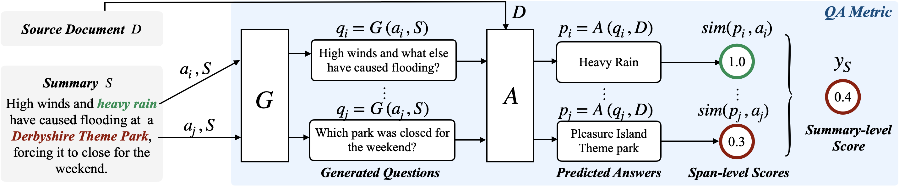

# Human Generated Questions in ''Shortcomings of Question Answering Based Factuality Frameworks for Error Localization''

Human generated questions used in the analysis in the paper [Shortcomings of Question Answering Based Factuality Frameworks for Error Localization](https://arxiv.org/pdf/2210.06748.pdf) (Section 6)

Ryo Kamoi, Tanya Goyal and Greg Durrett, EACL 2023 (main conference).

## Overview of this Paper

Our paper analyzes Question Answering based factuality evaluation frameworks such as [QuestEval](https://arxiv.org/pdf/2103.12693.pdf) and [QAFactEval](https://arxiv.org/pdf/2112.08542.pdf). Although QA-based frameworks are motivated by their interpretability, we show that this is not true and QA-based frameworks cannot localize errors in summaries.

QA-based franeworks consist of question answering (QA) and question generation (QG) models. In Section 6 of our paper, we evaluate the upporbound performance of QA-based framework by replacing QG model with human generated questions.

## Overview of this Repository

This repository includes human generated questions used in Section 6 of the paper.

`cliff_cnndm` and `cliff_xsum` directories include human generated questions for CNN/DM and XSum split of CLIFF dataset.

* `cliff_cnndm_{split}.json`: Subset of CLIFF dataset corresponding to the human annotated questions
* `human_generated_{question_type}_{split}.json`: human annotated questions
